<div align="center">


<h1>CIAM Reference Architecture</h1>

<p><strong>The Enterprise Flagship Platform for Secure, Frictionless, and Scalable Customer Identity Lifecycle Management</strong></p>

[]()
[]()
[]()
[]()
[]()

<br/>

> **"Identity is the new perimeter."** 
> CIAM Reference Architecture is an institutional-grade platform designed to provide a blueprint for modern customer identity, enabling secure registration, frictionless authentication, and centralized consent management at a global scale.

</div>

---

## 🏛️ Executive Summary

The **CIAM Reference Architecture** is a premium solution designed for CISOs, Identity Architects, and Digital Transformation leaders. In the digital-first economy, the ability to securely manage millions of customer identities while providing a seamless user experience is a primary competitive advantage.

This platform demonstrates an industrial-grade implementation of **Customer Identity and Access Management (CIAM)** using **Microsoft Entra External ID**, **React 18**, and **FastAPI**. It covers the entire identity lifecycle—from progressive profiling and social federation to risk-based authentication and regulatory compliance (GDPR/CCPA).

---

## 🚀 Business Outcomes & Drivers

### 🎯 Key Business Outcomes
- **Enhanced Customer Trust**: Securely manage user data and consent preferences.
- **Reduced Friction**: Enable social login and passwordless authentication to improve conversion.
- **Regulatory Compliance**: Centralized consent and audit logs to satisfy global privacy mandates.
- **Operational Scalability**: Multi-region architecture supporting millions of concurrent sessions.

### 🔑 Identity Modernization Drivers
- **Consumer Expectation**: Demand for frictionless, mobile-first login experiences.
- **Security Landscape**: Need for robust protection against credential stuffing and bot attacks.
- **Data Privacy**: Requirements for granular user consent and data sovereignty.

---

## 🛠️ Technical Stack

| Layer | Technology | Rationale |
|---|---|---|
| **Identity Provider** | Microsoft Entra External ID | Enterprise-grade, cloud-scale B2C identity service. |
| **Frontend** | React 18, Vite, Tailwind CSS | High-performance, customizable identity portal. |
| **Backend** | FastAPI (Python) | Asynchronous, type-safe API for profile and session management. |
| **Database** | PostgreSQL | Relational storage for customer metadata and audit trails. |
| **Infra (IaC)** | Terraform | Declarative management of Entra and Azure resources. |
| **Deployment** | AKS (Kubernetes) | Scalable hosting for identity and analytics microservices. |
| **Observability** | OpenTelemetry, Prometheus | Full-stack visibility into authentication success and latency. |

---

## 📐 Architecture Storytelling: 50+ Diagrams

### 1. High-Level CIAM Architecture
The executive view of the ecosystem, bridging the gap between customers and the secure backend.

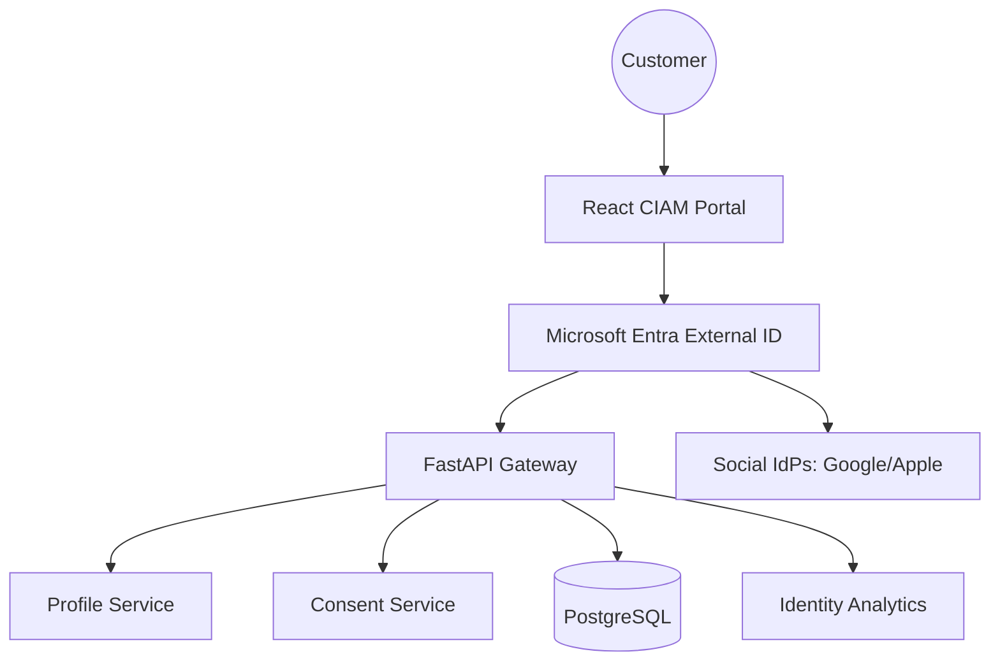

### 2. Detailed Component Topology
A deep dive into the network boundaries and service communication in Azure.

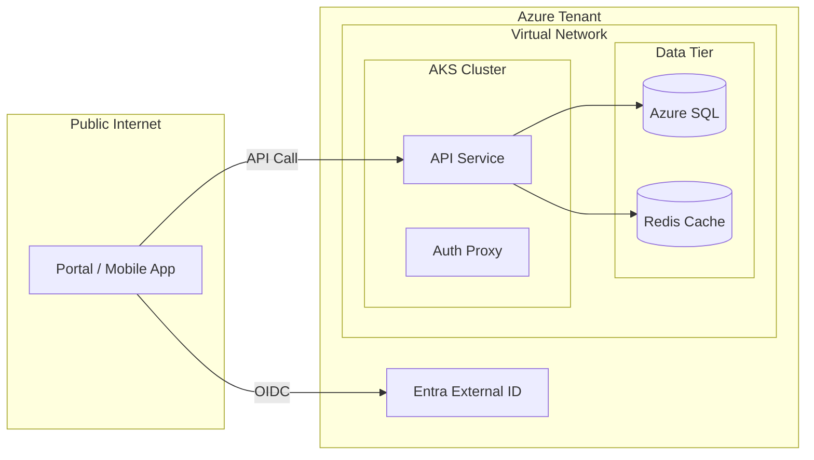

### 3. Customer Login Request Flow
Tracing a standard OIDC login sequence from the portal to token issuance.

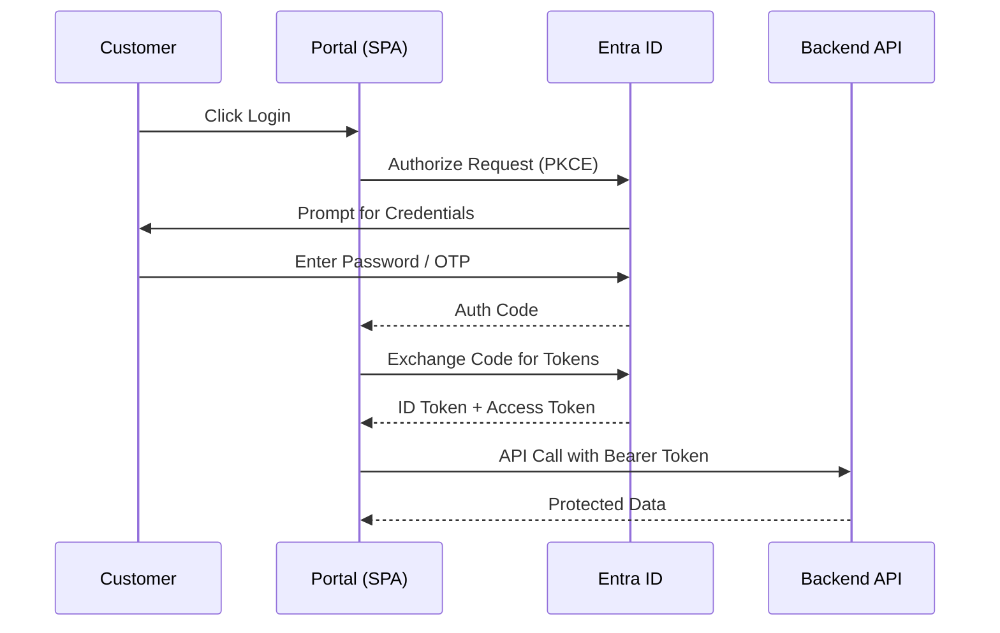

### 4. Registration Flow Architecture
The process of onboarding a new customer securely.

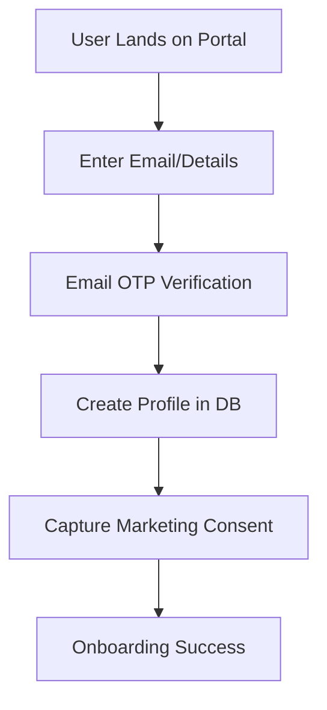

### 5. Session Management Model
How persistent and sliding sessions are maintained across devices.

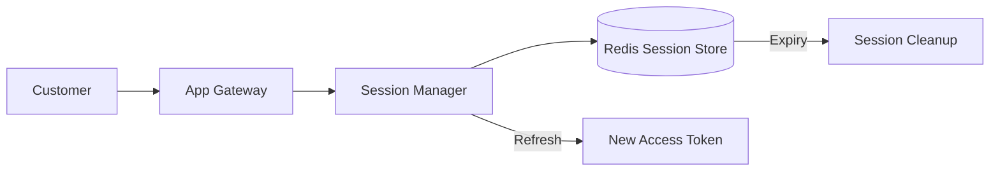

### 6. Token Issuance Architecture
Managing ID, Access, and Refresh tokens within the ecosystem.

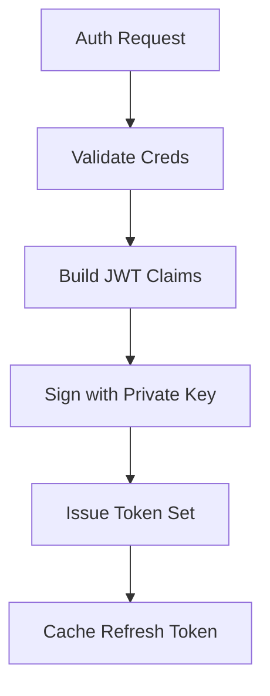

### 7. Multi-Tenant B2C Topology
Supporting multiple brands or business units in a single identity framework.

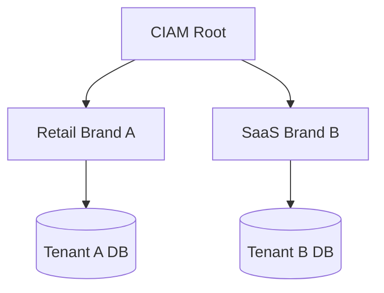

### 8. Regional HA Topology
Global identity availability with localized data residency.

```mermaid
graph LR
    DNS[Azure Front Door] --> US[US Region]
    DNS --> EU[Europe Region]
    US --> DB_US[(SQL US)]
    EU --> DB_EU[(SQL EU)]
    DB_US <->|Sync| DB_EU
```

### 9. Blue/Green Deployment Model
Ensuring zero-downtime for the CIAM portal and APIs.

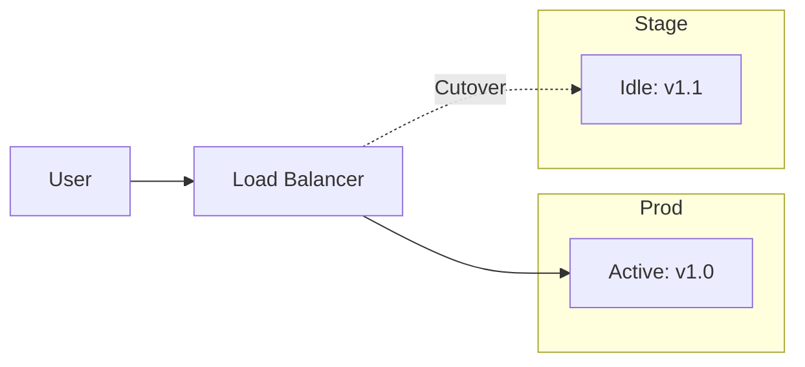

### 10. DR Failover Identity Model
Business continuity for critical authentication services.

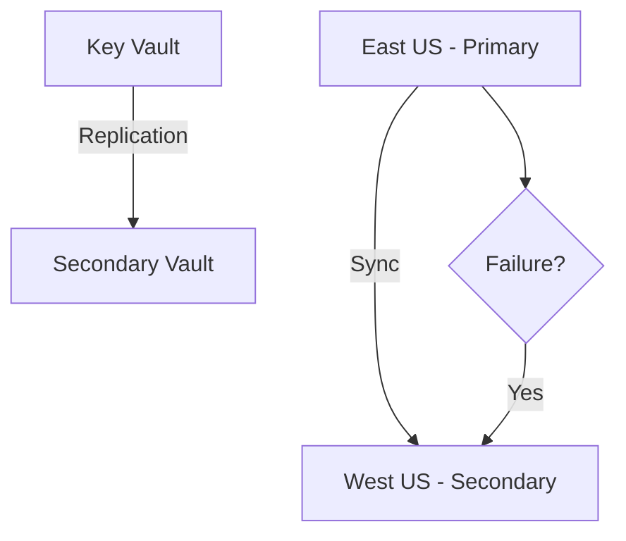

### 11. Sign-up Workflow
Detailed steps for a secure self-service registration.

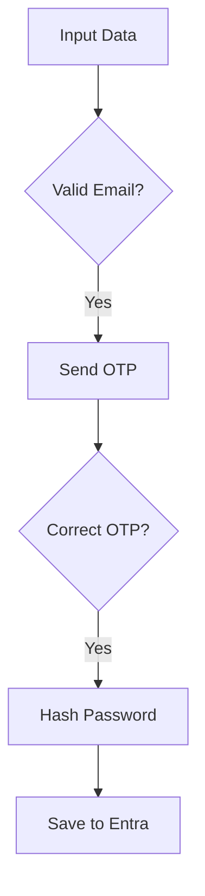

### 12. Email Verification Flow
Closing the loop on user identity verification.

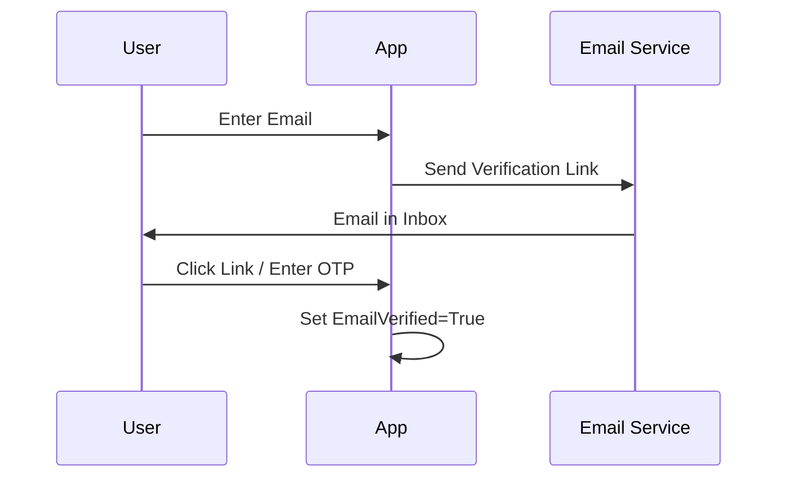

### 13. Password Reset Flow
The self-service recovery path for lost credentials.

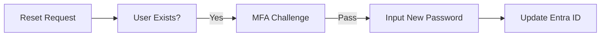

### 14. Social Login Flow
Frictionless onboarding using third-party identity providers.

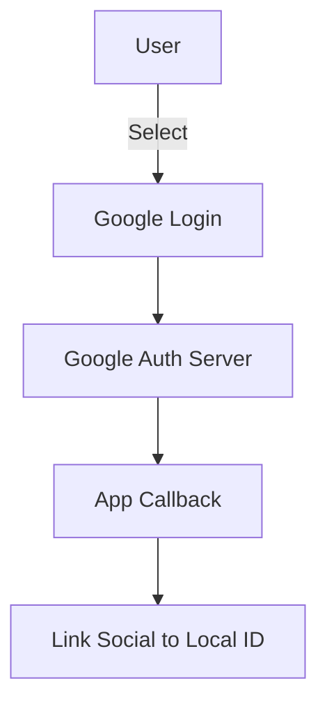

### 15. MFA Enrollment Flow
Securing accounts with multiple factors.

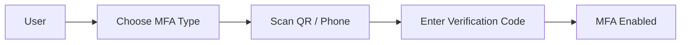

### 16. Passwordless Login Flow
Modern authentication without the burden of passwords.

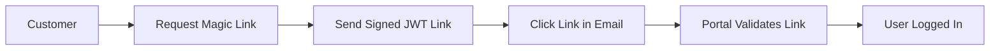

### 17. Progressive Profiling Flow
Gathering customer data over time to reduce registration friction.

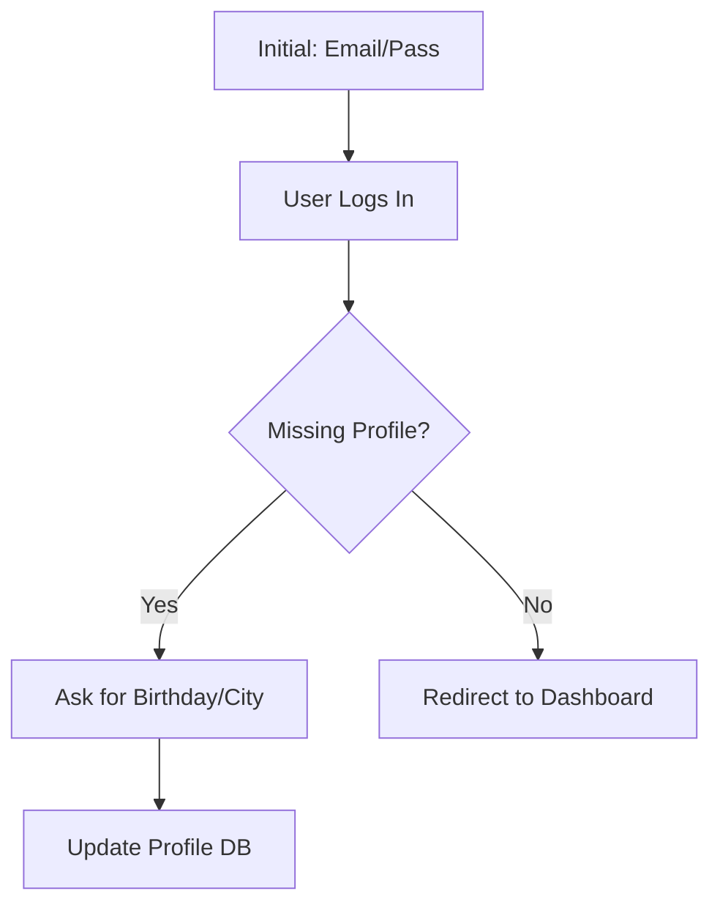

### 18. Account Recovery Workflow
The secure path for restoring access when all factors are lost.

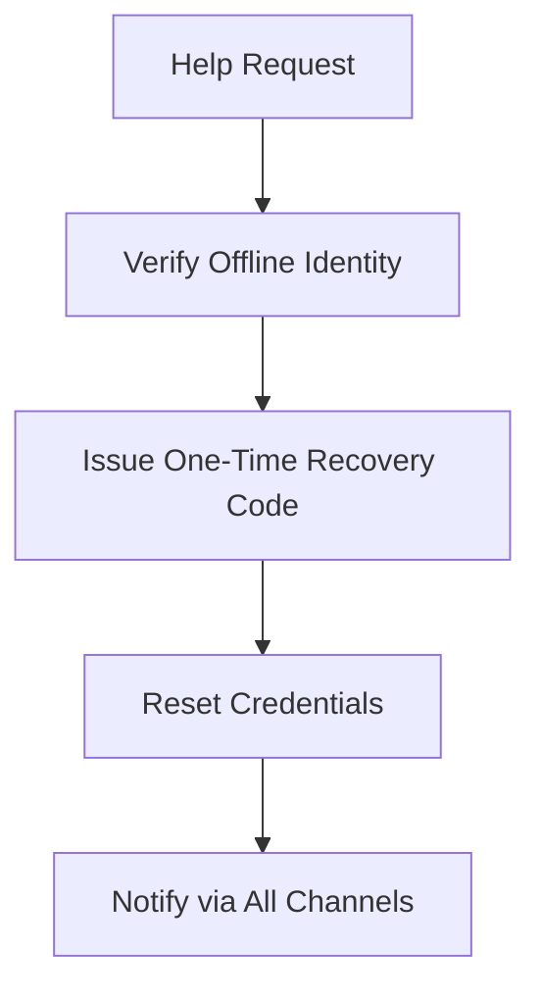

### 19. Consent Capture Flow
Ensuring transparency and compliance with GDPR/CCPA.

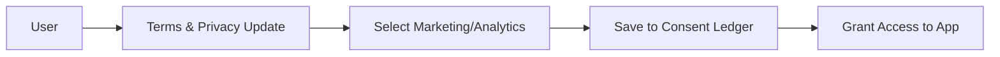

### 20. Customer Self-Service Portal Flow
Empowering users to manage their own identity and data.

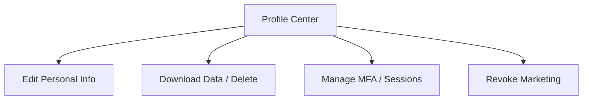

### 21. OIDC Authorization Code Flow
The industry-standard flow for web and mobile apps.

```mermaid
sequenceDiagram
    participant App
    participant Entra
    participant User
    
    App->>Entra: /authorize?client_id=...
    Entra->>User: Login Screen
    User->>Entra: Submit Creds
    Entra-->>App: code=XYZ
    App->>Entra: /token?code=XYZ
    Entra-->>App: id_token + access_token
```

### 22. OAuth Client Credentials Flow
Machine-to-machine authentication for background services.

```mermaid
graph LR
    Service[Background Worker] -->|Client Secret| Entra[Entra ID]
    Entra -->|JWT| Service
    Service -->|Bearer| API[Protected API]
```

### 23. SAML Federation Flow
Supporting legacy enterprise partners and SSO.

```mermaid
sequenceDiagram
    participant User
    participant SP[Service Provider]
    participant IdP[Partner Identity Provider]
    
    User->>SP: Access App
    SP->>IdP: SAML AuthRequest
    IdP->>User: Login
    IdP-->>SP: SAML Assertion (Post)
    SP->>User: Logged In
```

### 24. API Gateway Token Validation Flow
Validating JWTs at the edge for maximum performance.

```mermaid
graph TD
    Req[Client Request] --> GW[API Gateway]
    GW --> Cache[Check JKS Cache]
    Cache -->|Miss| JKS[Fetch Public Keys from Entra]
    JKS --> Validate[Verify Signature & Expiry]
    Validate --> Route[Route to Backend API]
```

### 25. RBAC Permission Model
Managing user permissions based on logical roles.

```mermaid
graph LR
    User --> Role[Premium Member]
    Role --> Perm1[Access Video Content]
    Role --> Perm2[Download Assets]
    Perm1 --> Resource[(Video Server)]
```

### 26. ABAC Decision Model
Granular access control based on attributes (location, age, status).

```mermaid
graph TD
    Policy[Access Policy] --> Check[Attribute Evaluation]
    Check -->|Age > 18| Allow[Grant Access]
    Check -->|Age < 18| Deny[Block Content]
```

### 27. Partner Federation Model
Enabling B2B and partner organizations to access resources.

```mermaid
graph LR
    PartnerIdP[Partner Azure/Okta] <-> Trust[Federation Trust]
    Trust <-> AppPortal[CIAM Portal]
    AppPortal --> Resources[Shared Apps]
```

### 28. Mobile Token Refresh Flow
Maintaining long-lived mobile sessions securely.

```mermaid
sequenceDiagram
    participant App as Mobile App
    participant Entra
    
    App->>Entra: /refresh?token=OLD
    Entra->>Entra: Validate Refresh Token
    Entra-->>App: New Access + New Refresh
    App->>App: Store Securely (Keychain)
```

### 29. SPA PKCE Flow
The secure OIDC flow for modern frontend applications.

```mermaid
graph TD
    Start[Generate Verifier] --> Challenge[Derive Challenge]
    Challenge --> Auth[Request with Challenge]
    Auth --> Token[Exchange with Verifier]
```

### 30. BFF Security Pattern
The "Backend-for-Frontend" pattern for maximum security.

```mermaid
graph LR
    SPA[React App] <->|HttpOnly Cookie| BFF[BFF API]
    BFF <->|JWT Bearer| Identity[Identity Service]
```

### 31. Zero Trust Trust-Boundary Model
Verifying every request regardless of origin.

```mermaid
graph TD
    User -->|Identity| Boundary[Zero Trust Proxy]
    Boundary -->|Policy| Service[Protected Service]
    Service -->|Audit| Log[Audit Trail]
```

### 32. WAF Boundary Architecture
Perimeter defense against identity-focused attacks.

```mermaid
graph LR
    Traffic[Internet] --> WAF[Azure WAF]
    WAF -->|Check SQLi/XSS| Clean[Clean Traffic]
    WAF -->|Rate Limit| Shield[DDOS Protection]
```

### 33. Secrets Management Lifecycle
Managing the rotation of signing and encryption keys.

```mermaid
stateDiagram-v2
    [*] --> Active: Key v1
    Active --> Rotated: Trigger Rotation
    Rotated --> Grace: Maintain Both
    Grace --> Purged: Delete v1
```

### 34. PII Encryption Flow
Protecting customer data at rest and in transit.

```mermaid
graph LR
    Data[Raw Name/Email] --> Encrypt[AES-256 GCM]
    Encrypt --> DB[(Encrypted SQL)]
    DB --> Decrypt[Authorized Access]
```

### 35. Fraud Detection Pipeline
Analyzing login patterns for anomalous behavior.

```mermaid
graph TD
    Login[Login Event] --> Analyze[Pattern Analysis]
    Analyze -->|Risk High| Block[Force MFA / Block]
    Analyze -->|Risk Low| Allow[Grant Access]
```

### 36. Bot Protection Workflow
Preventing automated credential stuffing and scraping.

```mermaid
graph LR
    Req[Incoming Req] --> CAPTCHA{Is Bot?}
    CAPTCHA -->|Yes| Block[Block IP]
    CAPTCHA -->|No| Service[Allow to Login]
```

### 37. Risk-Based Auth Decision Flow
Adjusting security requirements based on contextual risk.

```mermaid
graph TD
    Context[IP/Device/Location] --> Score[Risk Score]
    Score -->|Score > 80| Block
    Score -->|Score 40-79| StepUp[Step-up MFA]
    Score -->|Score < 40| Success
```

### 38. Audit Logging Pipeline
Centralizing all identity events for compliance and forensics.

```mermaid
graph LR
    API[Auth Events] --> Stream[Event Hub]
    Stream --> Storage[Blob Storage]
    Stream --> Analytics[Log Analytics]
```

### 39. Key Rotation Lifecycle
The process of rotating OIDC signing keys.

```mermaid
graph TD
    Cron[Schedule] --> NewKey[Generate New RSA Pair]
    NewKey --> Metadata[Update OIDC Discovery]
    Metadata --> Old[Deprecate Old Key]
```

### 40. Incident Response Model
Operational readiness for identity-related incidents.

```mermaid
graph LR
    Detect[Threat Detected] --> Assess[Impact Assessment]
    Assess --> Contain[Revoke Tokens / Block IPs]
    Contain --> Recover[Restore / Patch]
```

### 41. Monitoring Pipeline
Comprehensive visibility into identity service health.

```mermaid
graph LR
    Pod[Auth Pods] -->|Metrics| Prom[Prometheus]
    Prom -->|Dashboards| Grafana[Grafana]
    Grafana --> Alert[SLA Breach Alert]
```

### 42. Logging Architecture
Structured logging for large-scale identity portals.

```mermaid
graph TD
    App[CIAM App] --> Log[JSON Logs]
    Log --> FluentBit[FluentBit]
    FluentBit --> Hub[Event Hub]
    Hub --> Analytics[Azure Monitor]
```

### 43. Tracing Model
Distributed tracing for debugging complex auth flows.

```mermaid
sequenceDiagram
    participant UI
    participant BFF
    participant API
    participant Entra
    
    UI->>BFF: Login (TraceID: 1)
    BFF->>Entra: Auth (TraceID: 1)
    BFF->>API: Profile (TraceID: 1)
```

### 44. Alert Escalation Flow
Ensuring 24/7 availability for identity services.

```mermaid
graph TD
    Error[Login Failure Spike] --> Alert[PagerDuty]
    Alert --> Primary[Primary On-Call]
    Primary -->|No Ack| Secondary[Manager Escalation]
```

### 45. Identity Analytics Data Flow
Turning raw events into business insights.

```mermaid
graph LR
    Events[Auth Events] --> ETL[ETL Process]
    ETL --> DW[(Identity Warehouse)]
    DW --> BI[Conversion Dashboard]
```

### 46. Conversion Funnel Model
Visualizing the drop-off points in the registration journey.

```mermaid
graph TD
    Visit[Landing Page] --> Reg[Start Reg]
    Reg --> Verify[Email Verified]
    Verify --> Profile[Profile Done]
    Profile --> Login[First Login]
```

### 47. SLA Monitoring Flow
Tracking the 99.99% availability commitment.

```mermaid
graph LR
    Probe[Global Availability Probes] --> Metric[Uptime %]
    Metric -->|Below 99.99%| SLA[SLA Violation]
```

### 48. Capacity Scaling Model
Handling traffic spikes during marketing campaigns.

```mermaid
graph TD
    Load[CPU/Request Rate] --> HPA[Horizontal Pod Autoscaler]
    HPA --> Nodes[Cluster Autoscaler]
    Nodes --> Cap[Increased Capacity]
```

### 49. Backup Restore Flow
Protecting identity data and configurations.

```mermaid
graph LR
    DB[(Live DB)] --> Snapshot[Hourly Snapshot]
    Snapshot --> Vault[Geo-Redundant Vault]
    Vault --> Restore[Recovery Environment]
```

### 50. Compliance Reporting Workflow
Generating automated reports for GDPR/CCPA audits.

```mermaid
graph TD
    Logs[Audit Logs] --> Query[Compliance Query]
    Query --> Report[PDF Report]
    Report --> Auditor[Compliance Team]
```

---

## 🚦 Getting Started

### 1. Prerequisites
- **Azure Subscription** with Entra External ID permissions.
- **Docker Desktop** installed.
- **Terraform** (v1.5+).
- **Node.js** (v18+) and **Python** (v3.11+).

### 2. Local Environment Setup
To simulate the architecture locally using mock auth providers:
```bash
# Clone the repository
git clone https://github.com/Devopstrio/ciam-reference-architecture.git
cd ciam-reference-architecture

# Setup environment
cp .env.example .env

# Start core services
docker-compose up --build
```
Access the Portal at `http://localhost:3000`.

### 3. Production Deployment (Terraform)
```bash
cd infrastructure/terraform/envs/prod
terraform init
terraform apply -auto-approve
```

---

## 🛡️ Governance & Security
- **Zero-Trust Principles**: Every session is verified; every token is validated at the edge.
- **PII Protection**: Customer data is encrypted with customer-managed keys (CMK) where required.
- **Consent Ledger**: An immutable record of user consent is maintained for legal compliance.

---

## 📈 Roadmap
- [ ] **Biometric Support**: WebAuthn/FIDO2 for seamless desktop and mobile login.
- [ ] **Advanced Fraud Engine**: Integration with Azure Fraud Protection.
- [ ] **B2B Partner Portal**: Delegated administration for partner organizations.

---
<sub>&copy; 2026 Devopstrio &mdash; Engineering the Future of Customer Trust.</sub>
