<div align="center">


<h1>CIAM Reference Architecture</h1>

<p><strong>The Institutional-Grade Platform for Standardized Identity Foundations, Customer Governance, and Multi-Cloud CIAM Ecosystems.</strong></p>

[]()
[]()
[]()

<br/>

> **"Industrializing customer identity to automate identity foundations."** 
> **CIAM Reference Architecture** is an enterprise-grade platform designed to provide a secure, measurable, and highly automated foundation for global identity operations. It orchestrates the complex lifecycle of customer identity—from automated registration reconciliation and multi-cloud social federation to high-throughput consent intelligence and unified identity auditing.

</div>

---

## 🏛️ Executive Summary

Fragmented identity perimeters and manual consent management are strategic operational liabilities; lack of a standardized CIAM framework is a primary barrier to organizational engineering maturity. Organizations fail to secure their customer trust not because of a lack of credentials, but because of fragmented evaluation standards, lack of automated progressive profiling, and an inability to orchestrate identity planes with operational precision.

This platform provides the **Identity Intelligence Plane**. It implements a complete **CIAM-Reference-Architecture-as-Code Framework**, enabling CISOs and Identity Architects to manage global identity foundations as first-class citizens. By automating the identification of boundary regressions through real-time telemetry analysis and orchestrating the provisioning of secure performance-driven identity policies, we ensure that every organizational identity—from core customer profiles to edge microservice tokens—is verified by default, audited for history, and strictly aligned with institutional identity frameworks.

---

## 📐 Architecture Storytelling: Principal Reference Models

### 1. Principal Architecture: Global CIAM Reference Architecture & Identity Intelligence Plane
This diagram illustrates the end-to-end flow from identity telemetry ingestion and multi-cloud orchestration to identity enforcement, performance validation, and institutional identity auditing.

```mermaid
graph LR
    %% Subgraph Definitions
    subgraph IdentityIngress["Boundary & Profiling Ingress"]
        direction TB
        Auth_Signals["OIDC / SAML / OAuth2 Logs"]
        Consent_Signals["User Consents / Privacy Prefs"]
        Profile_Metadata["Progressive Profiling / Social Data"]
    end

    subgraph IntelligenceEngine["Identity Intelligence Hub"]
        direction TB
        API["FastAPI Identity Gateway"]
        AuthOrchestrator["Global Auth & Federation Hub"]
        Governance_Hub["Compliance & Guardrail Hub"]
        AIOps_Validator["Drift & Risk Analysis Hub"]
    end

    subgraph OperationsPlane["Distributed Identity Ecosystem"]
        direction TB
        ManagedIdentityNodes["Managed Standardized Identity Hubs"]
        ActiveRunbooks["Managed Automated Profile Runbooks"]
        IdentitySinks["Managed Infrastructure Delivery Hubs"]
    end

    subgraph OperationsHub["Institutional Data Hub"]
        direction TB
        Scorecard["Identity Maturity Scorecard"]
        Analytics["Auth Flow & Consent Velocity Stats"]
        Audit["Forensic Identity Metadata Lake"]
    end

    subgraph DevOps["CIAM-Reference-Architecture-as-Code Framework"]
        direction TB
        TF["Terraform Identity Modules"]
        DriftBot["Productivity & Config Drift Validator"]
        ChatOps["Measurement Operations Hub"]
    end

    %% Flow Arrows
    IdentityIngress -->|1. Submit Telemetry| API
    API -->|2. Orchestrate Identity| AuthOrchestrator
    AuthOrchestrator -->|3. Apply Privacy Guard| Governance_Hub
    Governance_Hub -->|4. Assess Drift| AIOps_Validator
    
    AIOps_Validator -->|5. Execute Enforcement| OperationsPlane
    OperationsPlane -->|6. Notify Status| ChatOps
    API -->|7. Visualize Health| Scorecard
    
    Scorecard -->|8. Track Maturity| Analytics
    Scorecard -->|9. Record Performance| Audit
    
    TF -->|10. Provision Backbone| IntelligenceEngine
    DriftBot -->|11. Inject Friction Risk| AuthOrchestrator
    Audit -->|12. Improve Operations| ManagedIdentityNodes

    %% Styling
    classDef ingress fill:#f5f5f5,stroke:#616161,stroke-width:2px;
    classDef intel fill:#e8eaf6,stroke:#1a237e,stroke-width:2px;
    classDef operations fill:#e1f5fe,stroke:#01579b,stroke-width:2px;
    classDef ops fill:#ede7f6,stroke:#311b92,stroke-width:2px;
    classDef devops fill:#e8f5e9,stroke:#1b5e20,stroke-width:2px;

    class IdentityIngress ingress;
    class IntelligenceEngine intel;
    class OperationsPlane operations;
    class OperationsHub ops;
    class DevOps devops;
```

### 2. The Identity Lifecycle Flow
The continuous path of a CIAM platform from initial integration (register) and aggregation (verify) to active analysis (authenticate), optimization (authorize), and institutional forensic auditing (scorecard).

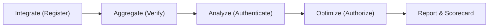

### 3. Distributed Identity Topology
Strategically orchestrating standardized identity across global regions, diverse cloud architectures, and multi-cloud targets, providing a unified institutional view of global identity health and operational readiness.

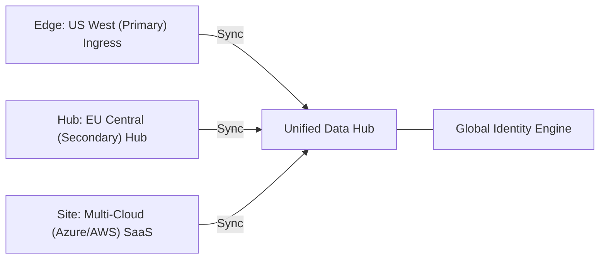

### 4. Identity Hub & High-Trust Data Plane Protection Flow
Executing complex logic for securing the bridge between identity owners and technical teams, ensuring every organizational identity is verified, profile-level privacy is maintained, and every identity access is according to institutional standards.

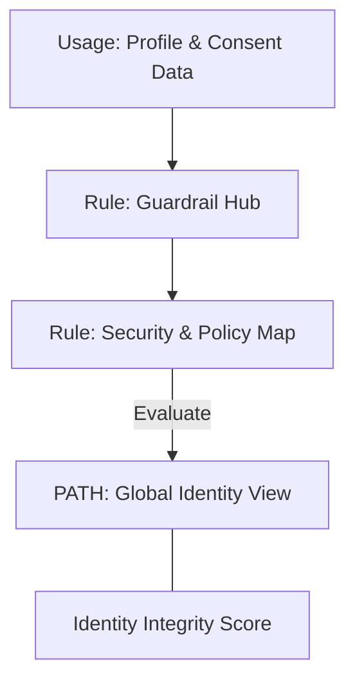

### 5. Multi-Cloud Identity Federation & Governance Flow
Automatically managing unified identity standards across global regions and diverse cloud tenants, ensuring institutional data residency and privacy boundaries by default.

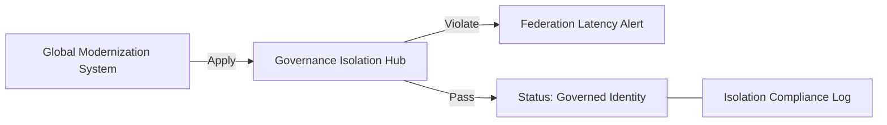

### 6. Encryption & Perimeter Protection Flow (Identity Standard)
Managing the lifecycle of an identity request, automatically enforcing institutional TLS 1.3 and resource encryption standards as required by security policy, ensuring zero-latency security confidence.

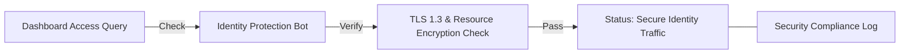

### 7. Institutional Identity Maturity Scorecard
Grading organizational performance based on key indicators: Authentication Velocity Index, Profile Integrity Index, and Consent Adoption Scores.

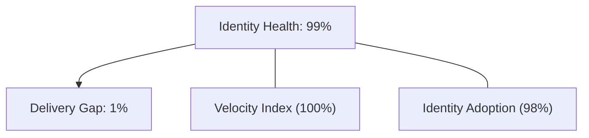

### 8. Identity & RBAC for Identity Governance
Managing fine-grained access to identity hubs, provisioning workers, and audit logs between CISOs, Identity Leads, and App Developers.

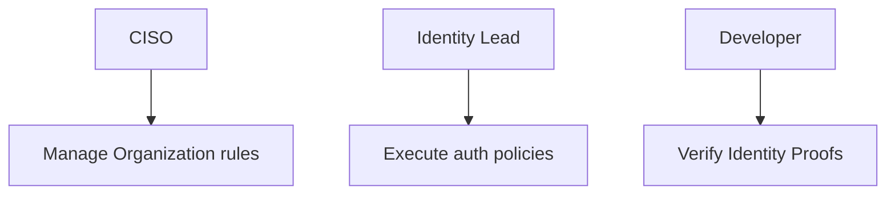

### 9. IaC Deployment: CIAM-Reference-Architecture-as-Code Framework
Using modular Terraform to deploy and manage the versioned distribution of the identity tracking hubs, auth protection workers, and forensic metadata lakes.

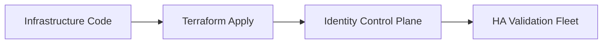

### 10. AIOps Identity Drift & Risk Validation Flow
Using advanced analytics to identify sudden surges in auth failures, unauthorized profile changes, suspicious configuration drifts, or unusual delivery pattern changes that could result in institutional risk or audit failure.

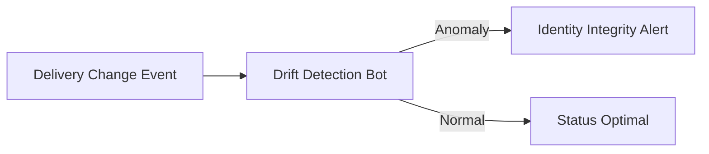

### 11. Metadata Lake for Forensic Identity Audit
Storing long-term records of every identity integration event (metadata), every token executed, and every version history for institutional record-keeping, compliance auditing, and post-provisioning forensics.

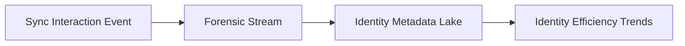

---

## 🏛️ Core Governance Pillars

1.  **Unified Foundation Coordination**: Maximizing resilience by centralizing all identity measurement through a single institutional plane.
2.  **Automated Profile Provisioning**: Eliminating "manual tracking" scenarios through proactive orchestration and pattern verification.
3.  **Sequential Auth Intelligence**: Ensuring zero-interruption operations through dependency-aware identity-driven data engineering.
4.  **Zero-Trust Identity Protection**: Automatically enforcing identity-based access, data-at-rest encryption, and policy evaluation across all assurance tiers.
5.  **Autonomous Operations Logic**: Guaranteeing reliability through automated industry-specific effectiveness monitoring runbooks.
6.  **Full Identity Auditability**: Immutable recording of every token change and identity provision for institutional forensics.

---

## 🛠️ Technical Stack & Implementation

### Identity Engine & APIs
*   **Framework**: Python 3.11+ / FastAPI.
*   **Performance Engine**: Custom Python-based logic for multi-cloud OIDC reconciliation and DORA-style identity metrics.
*   **Integrations**: Native connectors for Microsoft Entra External ID, Auth0, and Okta.
*   **Persistence**: PostgreSQL (Identity Ledger) and Redis (Live Auth State).
*   **Auth Orchestrator**: Federated OIDC/SAML for least-privilege identity management access.

### Governance Dashboard (UI)
*   **Framework**: React 18 / Vite.
*   **Theme**: Dark, Slate, Indigo (Modern high-fidelity productivity aesthetic).
*   **Visualization**: D3.js for delivery topologies and Recharts for auth velocity analytics.

### Infrastructure & DevOps
*   **Runtime**: AWS EKS or Azure Kubernetes Service (AKS) for management plane.
*   **Measurement Hub**: Managed event sourcing for immutable productivity timeline reconstruction.
*   **IaC**: Modular Terraform for deploying the identity landing zone and validation fleet.

---

## 🏗️ IaC Mapping (Module Structure)

| Module | Purpose | Real Services |
| :--- | :--- | :--- |
| **`infrastructure/identity_hub`** | Central management plane | EKS, PostgreSQL, Redis |
| **`infrastructure/enforcers`** | Distributed identity provisioners | Entra ID, Auth0, Okta APIs |
| **`infrastructure/auth_pipes`** | Data Ingestion Hubs | Webhooks, Lambda |
| **`infrastructure/auditing`** | Forensic modernization sinks | S3, Athena, Quicksight |

---

## 🚀 Deployment Guide

### Local Principal Environment
```bash
# Clone the CIAM Reference Architecture repository
git clone https://github.com/devopstrio/ciam-reference-architecture.git
cd ciam-reference-architecture

# Configure environment
cp .env.example .env

# Launch the Identity stack
make init

# Trigger a mock identity update and automated guardrail validation simulation
make simulate-auth
```

Access the Management Portal at `http://localhost:3000`.

---

## 📜 License
Distributed under the MIT License. See `LICENSE` for more information.

---
<div align="center">
  <p>© 2026 Devopstrio. All rights reserved.</p>
</div>
